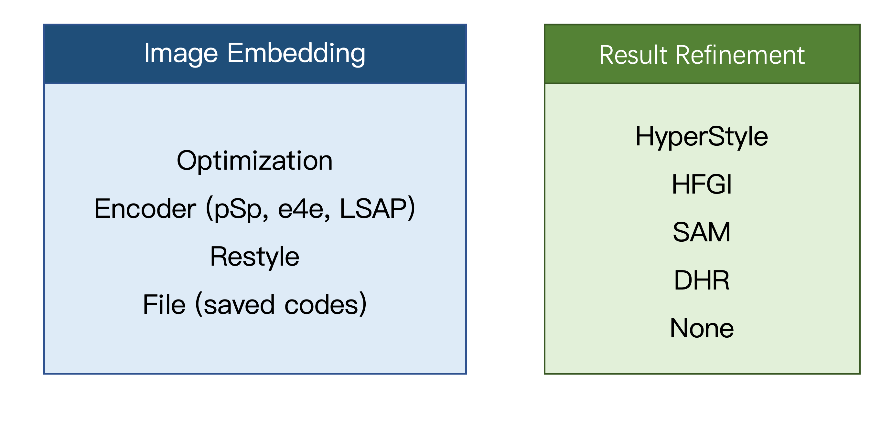

GAN Inverter is a GAN inversion toolbox based on PyTorch library. 

We collect SOTA inversion methods and construct a uniform pipeline with more features. Different methods and training strategies are convenient to compose and add. We hope that this toolbox could help people in every use.

## Table of Contents
  * [Features](#features)
  * [Recent Updates](#recent-updates)
  * [Model Zoo](#model-zoo)
  * [Unified Pipeline](#unified-pipeline)
  * [Installation](#installation)
  * [Getting Start](#getting-start)
    + [Preparing Data and Generator](#preparing-data-and-generator)
    + [Training](#training)
    + [Inference](#inference)
    + [Editing](#editing)
    + [Evaluation](#evaluation)
  * [Citation](#citation)

## Features
-  [x] Implementations of sota inversion methods.
-  [x] Unified training/evaluation/inference/editing process.
-  [x] Modular and flexible configuration. Easy to set options by config file (yaml) or command in every use.
-  [x] Additional training features.
    -  [x] Distributed training.
    -  [x] Weight & bias (wandb).
    -  [x] Automatically resume training.

We will release v2.0 around early 2023:
-  [ ] Documentation.
-  [ ] More inversion methods, including E2Style, Hyperstyle, SAM, HFGI.
-  [ ] Evaluation System.
-  [ ] More editing methods.
-  [ ] Make inversion easy to integrate in GAN-based downstream tasks.

## Recent Updates
**`2023.02`**: V1.1. Re-organized codes: methods' class, inference pipeline. 

**`2022.11`**: Add more optimizers and PTI is supported now.

**`2022.10`**: GAN Inverter v1.0 is released. Support methods: pSp, e4e, LSAP.

**`2022.09`**: LSAP is published on [arxiv](https://arxiv.org/abs/2209.12746).

## Model Zoo
Although previous works use encoder-based, optimization-based and hybrid method to categorize inversion methods, this set of division criteria is no longer appropriate at present.
According to the purpose of method, we divide inversion process into two steps: **Image Embedding** and **Result Refinement**:

- **Image Embedding** aims to embed image into latent code by encoder or optimization.
- **Result Refinement** aims to refine the initial inversion and editing results from the first step by various strategies (e.g., adjusting generator weight or intermediate feature).
### 1. Image Embedding Methods
|      |      Method       |      |                           Repo                           |                            Paper                             |    Source    |
| :--: | :---------------: | :--: | :------------------------------------------------------: | :----------------------------------------------------------: | :----------: |
|   :ballot_box_with_check:   |        pSp        |  E   |  [code](https://github.com/eladrich/pixel2style2pixel)   |          [paper](https://arxiv.org/abs/2008.00951)           |   CVPR2021   |
|   :ballot_box_with_check:   |        e4e        |  E   |    [code](https://github.com/omertov/encoder4editing)    |          [paper](https://arxiv.org/abs/2102.02766)           | SIGGRAPH2021 |
|   :ballot_box_with_check:   |       LSAP        |  E   |                                                          |       [paper](https://arxiv.org/abs/2209.12746)                                                       |    Arxiv     |
|   :white_medium_square:   |      E2Style      |  E   |       [code](https://github.com/wty-ustc/e2style)        | [paper](https://wty-ustc.github.io/inversion/paper/E2Style.pdf) |   TIP2022    |
|   :white_medium_square:   | Style Transformer |  E   | [code](https://github.com/sapphire497/style-transformer) |          [paper](https://arxiv.org/abs/2203.07932)           |   CVPR2022   |
|   :ballot_box_with_check:   | StyleGAN2(LPIPS)  |  O   | [code](https://github.com/rosinality/stylegan2-pytorch)  |           [paper](http://arxiv.org/abs/1912.04958)           |   CVPR2020   |

Note: ```E```/```O``` means encoder-based and optimization-based methods.

### 2. Result Refinement Methods

|      |      Method      |                        Repo                        |                   Paper                    |  Source  |
| :--: | :--------------: | :------------------------------------------------: | :----------------------------------------: | :------: |
|   :white_medium_square:   |    HyperStyle    | [code](https://github.com/yuval-alaluf/hyperstyle) | [paper](https://arxiv.org/abs/2111.15666)  | CVPR2022 |
|   :white_medium_square:   |       HFGI       |    [code](https://github.com/Tengfei-Wang/HFGI)    | [paper](https://arxiv.org/pdf/2109.06590)  | CVPR2022 |
|   :white_medium_square:   |       SAM        | [code](https://github.com/adobe-research/sam_inversion) | [paper](https://arxiv.org/abs/2206.08357) | CVPR2022 |
|   :ballot_box_with_check:   |       PTI        |     [code](https://github.com/danielroich/PTI)     | [paper](https://arxiv.org/abs/2106.05744) | TOG2022  |
|   :white_medium_square:   | Near Perfect GAN Inversion | - | [paper](https://arxiv.org/abs/2202.11833) |  Arxiv   |
|   :white_medium_square:   | FeatureStyleEncoder | [code](https://github.com/InterDigitalInc/FeatureStyleEncoder) | [paper](https://link.springer.com/chapter/10.1007/978-3-031-19784-0_34) |  ECCV22   |
| :ballot_box_with_check: | DHR | [code]([caopulan/GANInverter: A GAN inversion toolbox based on PyTorch library. (github.com)](https://github.com/caopulan/Domain-Specific_Hybrid_Refinement_Inversion)) | - | Arxiv |

### 3. Editing Methods

|      |    Method    |                       Repo                       |                   Paper                   |   Source    | Weight |
| :--: | :----------: | :----------------------------------------------: | :---------------------------------------: | :---------: | :----: |
|  :ballot_box_with_check:    | InterFaceGAN | [code](https://github.com/genforce/interfacegan) | [paper](https://arxiv.org/pdf/1907.10786) |  CVPR2020   |   -    |
|  :ballot_box_with_check:    |   GANSpace   |   [code](https://github.com/harskish/ganspace)   | [paper](https://arxiv.org/abs/2004.02546) | NeurIPS2020 |   -    |
|   :white_medium_square:   |  StyleClip   | [code](https://github.com/orpatashnik/StyleCLIP) | [paper](https://arxiv.org/abs/2103.17249) |  ICCV2021   |   -    |

## Benchmark

Based on the unified pipeline, we conduct a benchmark on face domain (CelebA-HQ test set).

### 1. Encoder-Only

|      Method       |                           Repo                           |                            Paper                             |    Source    |
| :---------------: | :------------------------------------------------------: | :----------------------------------------------------------: | :----------: |
|        pSp        |  [code](https://github.com/eladrich/pixel2style2pixel)   |          [paper](https://arxiv.org/abs/2008.00951)           |   CVPR2021   |
|        e4e        |    [code](https://github.com/omertov/encoder4editing)    |          [paper](https://arxiv.org/abs/2102.02766)           | SIGGRAPH2021 |
|       LSAP        |                                                          |          [paper](https://arxiv.org/abs/2209.12746)           |    Arxiv     |
|      E2Style      |       [code](https://github.com/wty-ustc/e2style)        | [paper](https://wty-ustc.github.io/inversion/paper/E2Style.pdf) |   TIP2022    |
| Style Transformer | [code](https://github.com/sapphire497/style-transformer) |          [paper](https://arxiv.org/abs/2203.07932)           |   CVPR2022   |
| StyleGAN2(LPIPS)  | [code](https://github.com/rosinality/stylegan2-pytorch)  |           [paper](http://arxiv.org/abs/1912.04958)           |   CVPR2020   |


## Unified Pipeline

### Two-Stage Inference Pipeline



We follow two-stage inference in this repository. The base inference class `TwoStageInference` is defined in ```./inference/two_stage_inference.py```. It follows two steps:

1. Image Embedding method to attain latent codes;
2. Result Refinement method to improve performance.

We conduct a uniform inversion process, which can easily combine two methods. **Users can try any combination of methods, not limited to those employed by the original authors.** For example, GANInverter make it possible to connect ReStyle with HyperStyle by ```--embed_mode restyle --refine_mode hyperstyle``` or PTI + e4e by `--embed_mode e4e --refine_mode pti`. 

For example:

- e4e: `--embed_mode e4e --refine_mode None`
- HFGI + e4e: `--embed_mode e4e --refine_mode HFGI`
- DHR + saved codes: `--embed_mode code --refine_mode dhr --code_path /path/to/code/xxxx.pt`

**Supported methods:**

| Option                 | Methods        | Note                                             |
| ---------------------- | -------------- | ------------------------------------------------ |
| `--embed_mode encoder` | pSp, e4e, LSAP |                                                  |
| `--embed_mode optim`   | Optimization   |                                                  |
| `--embed_mode code`    | Saved codes    | Need to set `--code_path`                        |
| `--refine_mode pti`    | PTI            | Using `--embed_mode optim` to attain $w_{pivot}$ |
| `--refine_mode dhr`    | DHR            |                                                  |

### Configs

We conduct unified config system in train/inference/test/edit. All options are saved in the config file, which can be conveniently determined for any use. 

We define all options in ```options/```. ```options/base_options.py``` contains communal options in every phase. 

Based on the config system, we set some rules to make this toolbox easier to use.

### Model checkpoint
You can load a checkpoint by two ways:
- ```--checkpoint_path xxxx.pt```: manually set checkpoint path to load. Although model architecture is slightly different from previous repository (e.g., pSp, e4e), the weight will be automatically converted to fit our architecture. You can use their original weight file.
- ```--auto_resume True```: automatically load ```{exp_dir}/checkpoints/last.pt``` in training phase or ```{exp_dir}/checkpoints/best_model.pt``` in the other phase.
### Dataset
- ```--train_dataset_path```, ```--batch_size```, ```--workers``` are used only in training.
- ```--test_dataset_path```, ```--test_batch_size```, ```--test_workers``` are default test/inference options in every use.


## Installation
Please refer to [Installation Instructions](docs/install.md) for the details of installation.

## Getting Start
### Preparing Data and Generator
Please refer to [Dataset Instructions](docs/dataset.md) for the details of datasets.
### Training

#### 1. Train encoder
**Example**: Train LSAP on FFHQ

##### **(1) Single-card training**

```bash
python scripts/train.py -c configs/lsap/lsap_ffhq_r50.yaml
```
##### **(2) Distributed training on 8 Cards**

```bash
python -m torch.distributed.launch --nproc_per_node=8 --master_port=12345 -c configs/lsap/lsap_ffhq_r50.yaml --gpu_num 8
```

**Notes:**
- set `--auto_resume True` for automatically resume.
- Batch size means total size of all gpus. It must be a multiple of gpu num.
- In our experiments, distributed training with batch size of 8 may much slower or accelerate marginally. For example, one iteration of e4e cost 50 sec on both one or two cards. However, distributed training can amplify the total batch size (batch size 8 cost 21G gpu memory) and may achieve fast convergence by large batch size and learning rate. If batch size increased to 16 on two cards (8 sample per card), cost per iteration only slightly increase (from 50 to <60 sec). We are glad to receive any suggestions to improve performance of distributed training.

#### 2. [TODO] Train refinement model based on encoder 

**Example: Train HFGI with LSAP on FFHQ.** 

### Inference

You can inference images by:

``````
python scripts/infer.py -c /path/to/config
``````

or

```
python scripts/infer.py \
	--embed_mode [embed_mode] \
	--refine_mode [refine_mode] \
	--test_dataset_path [/path/to/dataset]\
	--output_dir [/path/to/output] \
	--save_code [true/false] \
	--checkpoint_path [/path/to/checkpoint]
```

- ```--save_code```: whether to save latent code.
- ```--test_dataset_path```: image file or folder.
- ```--output_dir```: path to save inversion results. Inverse images will be saved in ```{output_dir}/inversion/``` and latent codes will be saved in ```{output_dir}/code/```. If not set, use ```{exp_dir}/inference/``` by default.
- ```--checkpoint_path```: model weight. 

**Example1: LSAP on CelebA-HQ.** 

```bash
python scripts/infer.py -c configs/lsap/lsap_ffhq_r50.yaml
```
**Example2: Optimization on CelebA-HQ.** 

```bash
python scripts/infer.py -c configs/optim/optim_celeba-hq.yaml
```
- ```--stylegan_weights```: whether to save latent code.

**Example3: PTI+e4e**

```
python scripts/infer.py -c configs/e4e/e4e_ffhq_r50.yaml --embed_mode encoder --refine_mode pti
```

### Editing

We have three ``embed_mode`` in editing: ```encoder```, ```optim```, and ```code```.
#### (1) Edit with encoder or optimization
```bash
python scripts/edit.py -c configs/lsap/lsap_ffhq_r50.yaml --edit_mode interfacegan --edit_path editing/interfacegan_directions/age.pt --edit_factor 1.0
```
#### (2) Edit with inverse codes
If you have inferred images first and saved the latent codes, you can edit these latent codes without inversion. We recommend "inference->edit" pipeline since editing with various attributes and factors will not cost extra inversion time.
```bash
python scripts/edit.py -c configs/optim/optim_celeba-hq.yaml --embed_mode code --test_dataset_path /path/to/latent/codes/ --edit_mode interfacegan --edit_path editing/interfacegan_directions/age.pt --edit_factor 1.0
```

### Evaluation
TODO

## Citation
If you use this toolbox for your research, please cite our repo.
```
@misc{cao2022ganinverter,
  author       = {Pu Cao and Dongxu Liu and Lu Yang and Qing Song},
  title        = {GAN Inverter},
  howpublished = {\url{https://github.com/caopulan/GANInverter}},
  year         = {2022},
}
```

```
@article{cao2022lsap,
  title={LSAP: Rethinking Inversion Fidelity, Perception and Editability in GAN Latent Space},
  author={Cao, Pu and Yang, Lu and Liu, Dongxv and Liu, Zhiwei and Wang, Wenguan and Li, Shan and Song, Qing},
  journal={arXiv preprint arXiv:2209.12746},
  year={2022}
}
```
