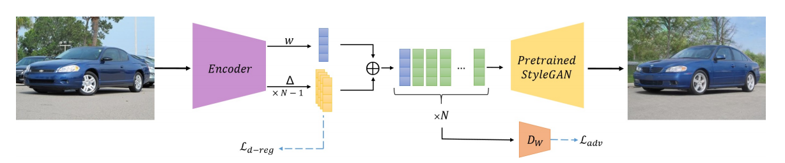

# Encoder For Editing (e4e) [SIGGRAPH 2021]

> [Designing an Encoder for StyleGAN Image Manipulation](https://arxiv.org/abs/2102.02766)

## Abstract

Recently, there has been a surge of diverse methods for performing image editing by employing pre-trained unconditional generators. Applying these methods on real images, however, remains a challenge, as it necessarily requires the inversion of the images into their latent space. To successfully invert a real image, one needs to find a latent code that reconstructs the input image accurately, and more importantly, allows for its meaningful manipulation. In this paper, we carefully study the latent space of StyleGAN, the state-of-the-art unconditional generator. We identify and analyze the existence of a distortion-editability tradeoff and a distortion-perception tradeoff within the StyleGAN latent space. We then suggest two principles for designing encoders in a manner that allows one to control the proximity of the inversions to regions that StyleGAN was originally trained on. We present an encoder based on our two principles that is specifically designed for facilitating editing on real images by balancing these tradeoffs. By evaluating its performance qualitatively and quantitatively on numerous challenging domains, including cars and horses, we show that our inversion method, followed by common editing techniques, achieves superior real-image editing quality, with only a small reconstruction accuracy drop.



## Results

TODO

## Inference

```
python scripts/infer.py \
	--config configs/e4e/e4e_ffhq_r50.yaml \
	--test_dataset_path /path/to/test/data \
    --output_dir /path/to/output/dir \
    --checkpoint_path /path/to/e4e/weight
```

## Citation

```latex
@article{tov2021designing,
  title={Designing an encoder for stylegan image manipulation},
  author={Tov, Omer and Alaluf, Yuval and Nitzan, Yotam and Patashnik, Or and Cohen-Or, Daniel},
  journal={ACM Transactions on Graphics (TOG)},
  volume={40},
  number={4},
  pages={1--14},
  year={2021},
  publisher={ACM New York, NY, USA}
}
```