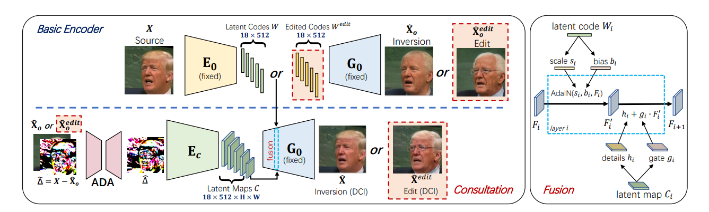

# HFGI: High-Fidelity GAN Inversion for Image Attribute Editing (CVPR 2022)

> [High-Fidelity GAN Inversion for Image Attribute Editing](https://arxiv.org/abs/2109.06590.pdf)

## Abstract

We present a novel high-fidelity generative adversarial network (GAN) inversion framework that enables attribute editing with image-specific details well-preserved (e.g., background, appearance, and illumination). We first analyze the challenges of high-fidelity GAN inversion from the perspective of lossy data compression. With a low bitrate latent code, previous works have difficulties in preserving high-fidelity details in reconstructed and edited images. Increasing the size of a latent code can improve the accuracy of GAN inversion but at the cost of inferior editability. To improve image fidelity without compromising editability, we propose a distortion consultation approach that employs a distortion map as a reference for high-fidelity reconstruction. In the distortion consultation inversion (DCI), the distortion map is first projected to a high-rate latent map, which then complements the basic low-rate latent code with more details via consultation fusion. To achieve high-fidelity editing, we propose an adaptive distortion alignment (ADA) module with a self-supervised training scheme, which bridges the gap between the edited and inversion images. Extensive experiments in the face and car domains show a clear improvement in both inversion and editing quality. The project page is https://tengfeiwang.github.io/HFGI/.



## Results

TODO

## Inference

```
python scripts/infer.py \
	--config configs/hfgi/hfgi.yaml \
	--test_dataset_path /path/to/test/data
    --output_dir /path/to/output/dir
    --checkpoint_path /path/to/hfgi/weight
```

## Citation

```latex
@inproceedings{wang2022high,
  title={High-fidelity gan inversion for image attribute editing},
  author={Wang, Tengfei and Zhang, Yong and Fan, Yanbo and Wang, Jue and Chen, Qifeng},
  booktitle={Proceedings of the IEEE/CVF Conference on Computer Vision and Pattern Recognition},
  pages={11379--11388},
  year={2022}
}
```

