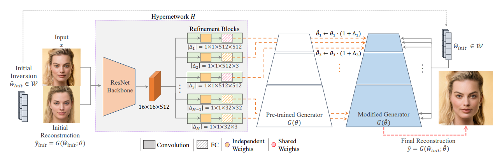

# HyperStyle: StyleGAN Inversion with HyperNetworks for Real Image Editing (CVPR 2022)

> [HyperStyle: StyleGAN Inversion with HyperNetworks for Real Image Editing](https://arxiv.org/abs/2111.15666)

## Abstract

The inversion of real images into StyleGAN’s latent space is a well-studied problem. Nevertheless, applying existing approaches to real-world scenarios remains an open challenge, due to an inherent trade-off between reconstruction and editability: latent space regions which can accurately represent real images typically suffer from degraded semantic control. Recent work proposes to mitigate this trade-off by fine-tuning the generator to add the target image to well-behaved, editable regions of the latent space. While promising, this fine-tuning scheme is impractical for
prevalent use as it requires a lengthy training phase for each new image. In this work, we introduce this approach into the realm of encoder-based inversion. We propose HyperStyle, a hypernetwork that learns to modulate StyleGAN’s weights to faithfully express a given image in editable regions of the latent space. A naive modulation approach would require training a hypernetwork with over three billion parameters. Through careful network design, we reduce this to be in line with existing encoders. HyperStyle yields reconstructions comparable to those of optimization techniques with the near real-time inference capabilities of encoders. Lastly, we demonstrate HyperStyle’s effectiveness on several applications beyond the inversion task, including the editing of out-of-domain images which were never seen during training. Code is available on our project page: https://yuval- alaluf.github.io/hyperstyle/.



## Results

TODO

## Inference

```
python scripts/infer.py \
	--config configs/hyperstyle/wencoder_ffhq_r50.yaml configs/hyperstyle/hyperstyle.yaml \
	--test_dataset_path /path/to/test/data
    --output_dir /path/to/output/dir
```

## Citation

```latex
@inproceedings{alaluf2022hyperstyle,
  title={Hyperstyle: Stylegan inversion with hypernetworks for real image editing},
  author={Alaluf, Yuval and Tov, Omer and Mokady, Ron and Gal, Rinon and Bermano, Amit},
  booktitle={Proceedings of the IEEE/CVF conference on computer Vision and pattern recognition},
  pages={18511--18521},
  year={2022}
}
```

