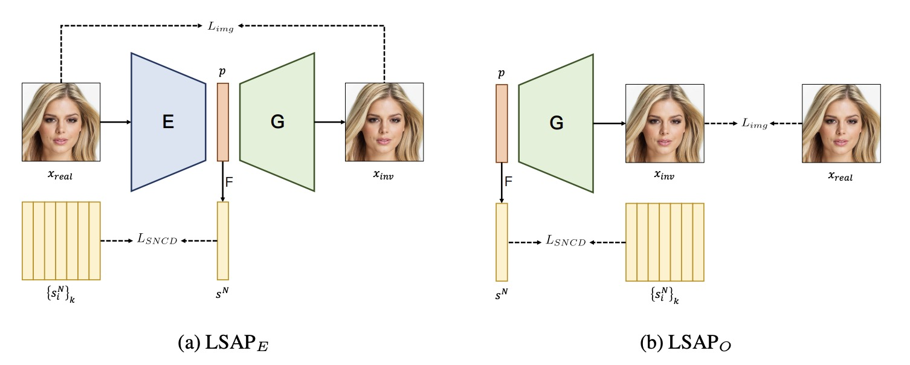

# LSAP: Rethinking Inversion Fidelity, Perception and Editability in GAN Latent Space [Arxiv2022]

> [LSAP: Rethinking Inversion Fidelity, Perception and Editability in GAN Latent Space](https://arxiv.org/abs/2301.12141)

## Abstract

As the research progresses, inversion is mainly divided into two steps. The first step is \emph{Image Embedding}, in which an encoder or optimization process embeds images to get the corresponding latent codes. Afterward, the second step aims to refine the inversion and editing results, which we named \emph{Result Refinement}. Although the second step significantly improves fidelity, perception and editability are almost unchanged and deeply depend on inverse latent codes from first step. Therefore, a crucial problem is gaining the latent codes with better perception and editability while retaining the reconstruction fidelity. In this work, we first point out that these two characteristics are related to the degree of alignment (or disalignment) of the inverse codes with the synthetic distribution. Then, we propose \textbf{L}atent \textbf{S}pace \textbf{A}lignment Inversion \textbf{P}aradigm (LSAP), which consists of an evaluation metric and solutions for inversion. Specifically, we introduce Normalized Style Space ($\mathcal{S^N}$ space) and **N**ormalized **S**tyle Space **C**osine **D**istance (NSCD) to measure disalignment of inversion methods. Meanwhile, it can be optimized in both encoder-based and optimization-based embedding methods to conduct a uniform alignment solution. Extensive experiments in various domains demonstrate that NSCD effectively reflects perception and editability, and our alignment paradigm archives the state-of-the-art in both two stages. 



## Results

TODO

## Inference

```
python scripts/infer.py \
	--config configs/lsap/lsap_ffhq_r50.yaml \
	--test_dataset_path /path/to/test/data
    --output_dir /path/to/output/dir
```

## Citation

```latex
@article{cao2022lsap,
  title={LSAP: Rethinking Inversion Fidelity, Perception and Editability in GAN Latent Space},
  author={Cao, Pu and Yang, Lu and Liu, Dongxv and Liu, Zhiwei and Li, Shan and Song, Qing},
  journal={arXiv preprint arXiv:2209.12746},
  year={2022}
}
```

