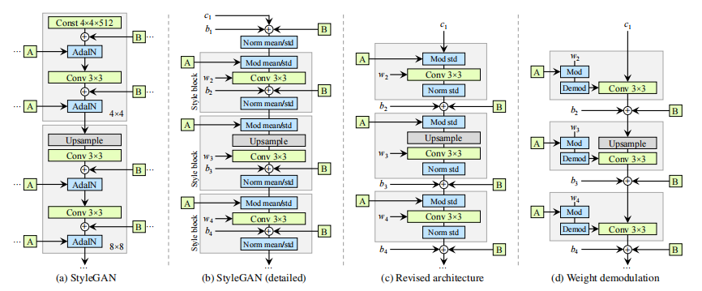

# StyleGAN2 (Optim) [CVPR2020]

> [Analyzing and Improving the Image Quality of StyleGAN](https://arxiv.org/abs/1912.04958)

## Abstract

The style-based GAN architecture (StyleGAN) yields state-of-the-art results in data-driven unconditional generative image modeling. We expose and analyze several of its characteristic artifacts, and propose changes in both model architecture and training methods to address them. In particular, we redesign the generator normalization, revisit progressive growing, and regularize the generator to encourage good conditioning in the mapping from latent codes to images. In addition to improving image quality, this path length regularizer yields the additional benefit that the generator becomes significantly easier to invert. This makes it possible to reliably attribute a generated image to a particular network. We furthermore visualize how well the generator utilizes its output resolution, and identify a capacity problem, motivating us to train larger models for additional quality improvements. Overall, our improved model redefines the state of the art in unconditional image modeling, both in terms of existing distribution quality metrics as well as perceived image quality.



## Results

TODO

## Inference

```
python scripts/infer.py \
	--config configs/optim/optim_celeba-hq.yaml \
	--test_dataset_path /path/to/test/data
    --output_dir /path/to/output/dir
```

## Citation

```latex
@inproceedings{karras2020analyzing,
  title={Analyzing and improving the image quality of stylegan},
  author={Karras, Tero and Laine, Samuli and Aittala, Miika and Hellsten, Janne and Lehtinen, Jaakko and Aila, Timo},
  booktitle={Proceedings of the IEEE/CVF conference on computer vision and pattern recognition},
  pages={8110--8119},
  year={2020}
}
```