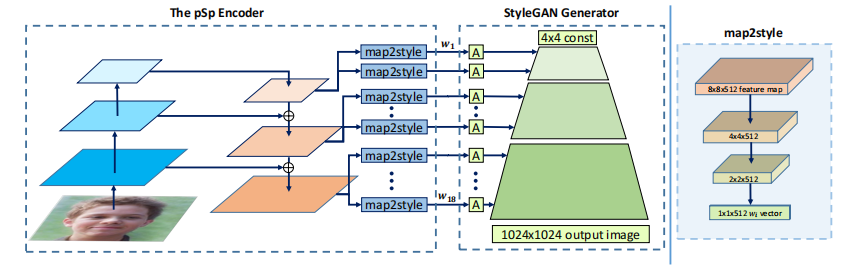

# pixel2style2pixel (pSp) [CVPR2021]

> [Encoding in Style: a StyleGAN Encoder for Image-to-Image Translation](https://arxiv.org/abs/2008.00951)

## Abstract

We present a generic image-to-image translation framework, pixel2style2pixel (pSp). Our pSp framework is based on a novel encoder network that directly generates a series of style vectors which are fed into a pretrained StyleGAN generator, forming the extended W+ latent space. We first show that our encoder can directly embed real images into W+, with no additional optimization. Next, we propose utilizing our encoder to directly solve image-to-image translation tasks, defining them as encoding problems from some input domain into the latent domain. By deviating from the standard “invert first, edit later” methodology used with previous StyleGAN encoders, our approach can handle a variety of tasks even when the input image is not represented in the StyleGAN domain. We show that solving translation tasks through StyleGAN significantly simplifies the training process, as no adversary is required, has better support for solving tasks without pixel-to-pixel correspondence, and inherently supports multi-modal synthesis via the resampling of styles. Finally, we demonstrate the potential of our framework on a variety of facial image-to-image translation tasks, even when compared to state-of-the-art solutions designed specifically for a single task, and further show that it can be extended beyond the human facial domain. Code is available at https://github.com/eladrich/pixel2style2pixel.



## Results

TODO

## Inference

```
python scripts/infer.py \
	--config configs/psp/psp_ffhq_r50.yaml \
	--test_dataset_path /path/to/test/data
    --output_dir /path/to/output/dir
```

## Citation

```latex
@inproceedings{richardson2021encoding,
  title={Encoding in style: a stylegan encoder for image-to-image translation},
  author={Richardson, Elad and Alaluf, Yuval and Patashnik, Or and Nitzan, Yotam and Azar, Yaniv and Shapiro, Stav and Cohen-Or, Daniel},
  booktitle={Proceedings of the IEEE/CVF conference on computer vision and pattern recognition},
  pages={2287--2296},
  year={2021}
}
```

