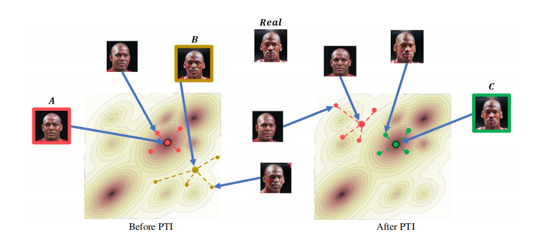

# Pivotal Tuning (PTI) [ACM TOG 2022]

> [Pivotal Tuning for Latent-based Editing of Real Images](https://arxiv.org/abs/2106.05744)

## Abstract

Recently, a surge of advanced facial editing techniques have been proposed that leverage the generative power of a pre-trained StyleGAN. To successfully edit an image this way, one must first project (or invert) the image into the pre-trained generator’s domain. As it turns out, however, StyleGAN’s latent space induces an inherent tradeoff between distortion and editability, i.e. between maintaining the original appearance and convincingly altering some of its attributes. Practically, this means it is still challenging to apply ID-preserving facial latent-space editing to faces which are out of the generator’s domain. In this paper, we present an approach to bridge this gap. Our technique slightly alters the generator, so that an out-of-domain image is faithfully mapped into an in-domain latent code. The key idea is pivotal tuning — a brief training process that preserves the editing quality of an in-domain latent region, while changing its portrayed identity and appearance. In Pivotal Tuning Inversion (PTI), an initial inverted latent code serves as a pivot, around which the generator is finedtuned. At the same time, a regularization term keeps nearby identities intact, to locally contain the effect. This surgical training process ends up altering appearance features that represent mostly identity, without affecting editing capabilities. To supplement this, we further show that pivotal tuning can also adjust the generator to accommodate a multitude of faces, while introducing negligible distortion on the rest of the domain. We validate our technique through inversion and editing metrics, and show preferable scores to state-of-the-art methods. We further qualitatively demonstrate our technique by applying advanced edits (such as pose, age, or expression) to numerous images of well-known and recognizable identities. Finally, we demonstrate resilience to harder cases, including heavy make-up, elaborate hairstyles and/or headwear, which otherwise could not have been successfully inverted and edited by state-of-the-art methods. Source code can be found at:https://github.com/danielroich/PTI.



## Results

TODO

## Inference

```
python scripts/infer.py \
	--config configs/pti/pti_pivot.yaml configs/pti/pti.yaml \
	--test_dataset_path /path/to/test/data
    --output_dir /path/to/output/dir
```

- `--save_intermidiated`: If true, DHR will save intermediated information like segmentation, modulated feature, and modulated weight. 

## Citation

```latex
@article{roich2022pivotal,
  title={Pivotal tuning for latent-based editing of real images},
  author={Roich, Daniel and Mokady, Ron and Bermano, Amit H and Cohen-Or, Daniel},
  journal={ACM Transactions on Graphics (TOG)},
  volume={42},
  number={1},
  pages={1--13},
  year={2022},
  publisher={ACM New York, NY}
}
```

