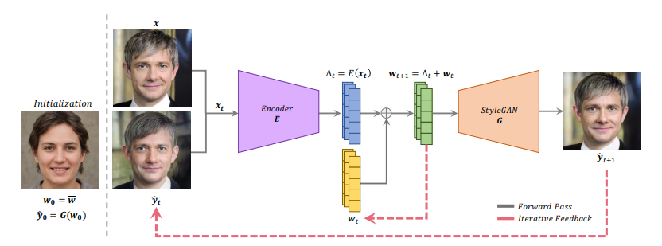

# ReStyle: A Residual-Based StyleGAN Encoder via Iterative Refinement (ICCV 2021)

> [ReStyle: A Residual-Based StyleGAN Encoder via Iterative Refinement](https://arxiv.org/abs/2104.02699)

## Abstract

Recently, the power of unconditional image synthesis has significantly advanced through the use of Generative Adversarial Networks (GANs). The task of inverting an image into its corresponding latent code of the trained GAN is of utmost importance as it allows for the manipulation of real
images, leveraging the rich semantics learned by the network. Recognizing the limitations of current inversion approaches, in this work we present a novel inversion scheme that extends current encoder-based inversion methods by introducing an iterative refinement mechanism. Instead of directly predicting the latent code of a given real image using a single pass, the encoder is tasked with predicting a residual with respect to the current estimate of the inverted latent code in a self-correcting manner. Our residualbased encoder, named ReStyle, attains improved accuracy compared to current state-of-the-art encoder-based methods with a negligible increase in inference time. We analyze the behavior of ReStyle to gain valuable insights into its iterative nature. We then evaluate the performance of our residual encoder and analyze its robustness compared to optimization-based inversion and state-of-the-art encoders. Code is available via our project page: https://yuval-alaluf.github.io/restyle-encoder/



## Results

TODO

## Inference

```
python scripts/infer.py \
	--config configs/restyle/restyle_e4e_ffhq_r50.yaml \
	--test_dataset_path /path/to/test/data
    --output_dir /path/to/output/dir
```

## Citation

```latex
@inproceedings{alaluf2021restyle,
  title={Restyle: A residual-based stylegan encoder via iterative refinement},
  author={Alaluf, Yuval and Patashnik, Or and Cohen-Or, Daniel},
  booktitle={Proceedings of the IEEE/CVF International Conference on Computer Vision},
  pages={6711--6720},
  year={2021}
}
```

