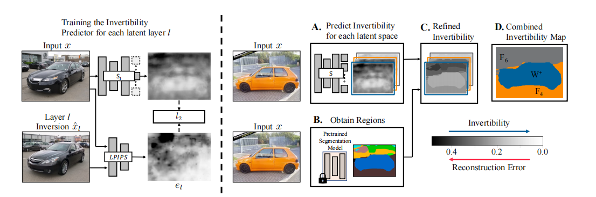

# Spatially-Adaptive Multilayer Selection (SAM) [CVPR2022]

> [Spatially-Adaptive Multilayer Selection for GAN Inversion and Editing](https://arxiv.org/abs/2206.08357)

## Abstract

Existing GAN inversion and editing methods work well for aligned objects with a clean background, such as portraits and animal faces, but often struggle for more difficult categories with complex scene layouts and object occlusions, such as cars, animals, and outdoor images. We propose a new method to invert and edit such complex images in the latent space of GANs, such as StyleGAN2. Our key idea is to explore inversion with a collection of layers, spatially adapting the inversion process to the difficulty of the image. We learn to predict the “invertibility” of different image segments and project each segment into a latent layer. Easier regions can be inverted into an earlier layer in the generator’s latent space, while more challenging regions can be inverted into a later feature space. Experiments show that our method obtains better inversion results compared to the recent approaches on complex categories, while maintaining downstream editability. Please refer to our project page at https://www.cs.cmu.edu/˜SAMInversion.



## Results

TODO

## Inference

```
python scripts/infer.py \
	--config configs/e4e/e4e_ffhq_r50.yaml configs/sam/sam.yaml \
	--test_dataset_path /path/to/test/data
    --output_dir /path/to/output/dir
    --checkpoint_path /path/to/e4e/weight
```

- `--save_intermidiated`: If true, DHR will save intermediated information like segmentation, modulated feature, and modulated weight. 

## Citation

```latex
@inproceedings{parmar2022spatially,
  title={Spatially-adaptive multilayer selection for gan inversion and editing},
  author={Parmar, Gaurav and Li, Yijun and Lu, Jingwan and Zhang, Richard and Zhu, Jun-Yan and Singh, Krishna Kumar},
  booktitle={Proceedings of the IEEE/CVF Conference on Computer Vision and Pattern Recognition},
  pages={11399--11409},
  year={2022}
}
```

